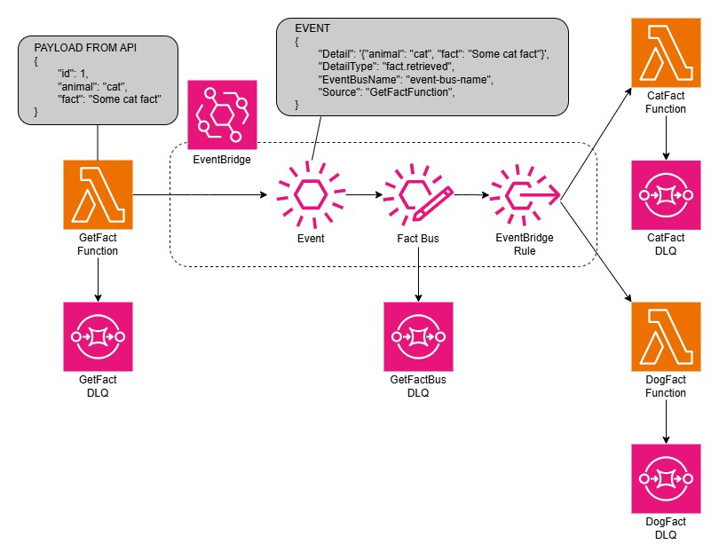

# Architecture

- [Get Fact Function](#get-fact-function)
  - [Payload](#payload)
  - [Event](#event)
- [Fact Bus](#fact-bus)
  - [EventBridge Rules](#eventbridge-rules)
- [Cat Fact Function](#cat-fact-function)
- [Dog Fact Function](#dog-fact-function)

## Get Fact Function

Is triggered manually and makes a call to the API to retrieve a random animal fact. The `id` is removed from the returned payload and the remaining data is put onto the Event Bus via the [event](#event).

### Payload

This is the payload that is returned from the API and is similiar to the below.

```json
{
    "id": 1,
    "animal": "cat",
    "fact": "A random cat fact"
}
```

### Event

This is the event that gets put onto the [Event Bus](#fact-bus) and is similiar to the below.

```json
{
    "Detail": "{'animal': 'cat', 'fact': 'A random cat fact'}",
    "DetailType": "fact.retrieved",
    "EventBusName": "fact-bus-arn",
    "Source": "GetFactFunction",
}
```

The `EventBusName` is the arn of the Event Bus that the event will be put on.

## Fact Bus

This is a Custom Event Bus, that in conjuction with [EventBridge rules](#eventbridge-rules), direct the events to the correct receiving lambda function.

### EventBridge Rules

There are 2 rules and both filter on `animal` under the `detail` section of the event. One rule looks for cat facts and will send them to the [CatFactFunction](#cat-fact-function), while the other rule looks for dog facts and sends them to the [DogFactFunction](#dog-fact-function).

## Cat Fact Function

This receives the cat facts, gets the fact from the event and then logs this out.

## Dog Fact Function

This receives the dog facts, gets the fact from the event, counts how many times the word `dog` appears in the fact and then logs this out along with the fact.

## Service Architecture

Even though they're not on the diagram, it should be noted that all the Functions, as well as the Event Bus, have an associated DLQ.


